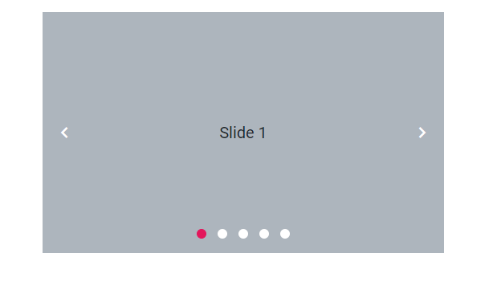
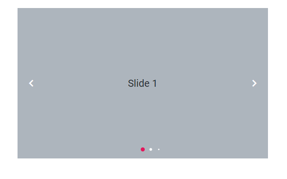
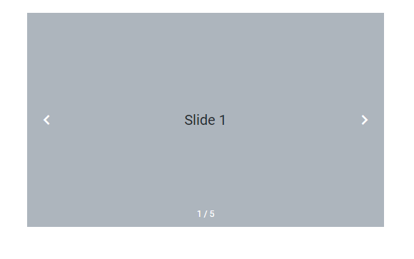
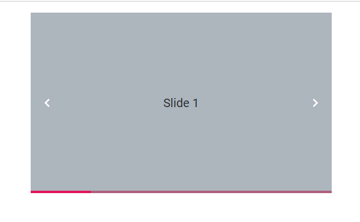

# Navigators and Indicators with Blazor Carousel Component

The navigators and indicators are used to transition the slides manually.

## Navigators

### Show or hide previous and next button

In navigators, the previous and next slide transition buttons are used to perform slide transitions manually. You can show/hide the navigators using the [ButtonsVisibility](https://help.syncfusion.com/cr/blazor/Syncfusion.Blazor.Navigations.SfCarousel.html#Syncfusion_Blazor_Navigations_SfCarousel_ButtonsVisibility) property. The possible property values are as follows:

- `Hidden` – the navigator’s buttons are not visible.
- `Visible` – the navigator’s buttons are visible.
- `VisibleOnHover` – the navigator’s buttons are visible only when hovering over the carousel.

The following example depicts the code to hide the navigators in the carousel.

```cshtml
@using Syncfusion.Blazor.Navigations

<div class="control-container">
    <SfCarousel ButtonsVisibility="CarouselButtonVisibility.Hidden">
        <CarouselItem>
            <div class="slide-content">Slide 1</div>
        </CarouselItem>
        <CarouselItem>
            <div class="slide-content">Slide 2</div>
        </CarouselItem>
        <CarouselItem>
            <div class="slide-content">Slide 3</div>
        </CarouselItem>
        <CarouselItem>
            <div class="slide-content">Slide 4</div>
        </CarouselItem>
        <CarouselItem>
            <div class="slide-content">Slide 5</div>
        </CarouselItem>
    </SfCarousel>
</div>

<style>
    .control-container {
        background-color: #adb5bd;
        height: 300px;
        margin: 0 auto;
        width: 500px;
    }

    .e-carousel .slide-content {
        align-items: center;
        display: flex;
        font-size: 1.25rem;
        height: 100%;
        justify-content: center;
    }
</style>
```


### Show previous and next button on hover

In the carousel, you can show the previous and next buttons only on mouse hover using the [ButtonsVisibility](https://help.syncfusion.com/cr/blazor/Syncfusion.Blazor.Navigations.SfCarousel.html#Syncfusion_Blazor_Navigations_SfCarousel_ButtonsVisibility) property. The following example depicts the code to show the navigators on mouse hover in the carousel.

```cshtml
@using Syncfusion.Blazor.Navigations

<div class="control-container">
    <SfCarousel ButtonsVisibility="CarouselButtonVisibility.VisibleOnHover">
        <CarouselItem>
            <div class="slide-content">Slide 1</div>
        </CarouselItem>
        <CarouselItem>
            <div class="slide-content">Slide 2</div>
        </CarouselItem>
        <CarouselItem>
            <div class="slide-content">Slide 3</div>
        </CarouselItem>
        <CarouselItem>
            <div class="slide-content">Slide 4</div>
        </CarouselItem>
        <CarouselItem>
            <div class="slide-content">Slide 5</div>
        </CarouselItem>
    </SfCarousel>
</div>

<style>
    .control-container {
        background-color: #adb5bd;
        height: 300px;
        margin: 0 auto;
        width: 500px;
    }

    .e-carousel .slide-content {
        align-items: center;
        display: flex;
        font-size: 1.25rem;
        height: 100%;
        justify-content: center;
    }
</style>
```


### Previous and next button template

Template options are provided to customize the previous button using [PreviousButtonTemplate](https://help.syncfusion.com/cr/blazor/Syncfusion.Blazor.Navigations.SfCarousel.html#Syncfusion_Blazor_Navigations_SfCarousel_PreviousButtonTemplate) and the next button using [NextButtonTemplate](https://help.syncfusion.com/cr/blazor/Syncfusion.Blazor.Navigations.SfCarousel.html#Syncfusion_Blazor_Navigations_SfCarousel_NextButtonTemplate). The following example depicts the code for applying the template to previous and next buttons in the carousel.

```cshtml
@using Syncfusion.Blazor.Buttons
@using Syncfusion.Blazor.Navigations

<div class="control-container">
    <SfCarousel>
        <ChildContent>
            <CarouselItem>
                <div class="slide-content">Slide 1</div>
            </CarouselItem>
            <CarouselItem>
                <div class="slide-content">Slide 2</div>
            </CarouselItem>
            <CarouselItem>
                <div class="slide-content">Slide 3</div>
            </CarouselItem>
            <CarouselItem>
                <div class="slide-content">Slide 4</div>
            </CarouselItem>
            <CarouselItem>
                <div class="slide-content">Slide 5</div>
            </CarouselItem>
        </ChildContent>
        <PreviousButtonTemplate>
            <SfButton CssClass="e-flat e-outline nav-btn" title="Previous">
                <svg xmlns="http://www.w3.org/2000/svg" viewBox="0 0 40 40" width="40" height="40">
                    <path d="m13.5 7.01 13 13m-13 13 13-13"></path>
                </svg>
            </SfButton>
        </PreviousButtonTemplate>
        <NextButtonTemplate>
            <SfButton CssClass="e-flat e-outline nav-btn" title="Next">
                <svg xmlns="http://www.w3.org/2000/svg" viewBox="0 0 40 40" width="40" height="40">
                    <path d="m13.5 7.01 13 13m-13 13 13-13"></path>
                </svg>
            </SfButton>
        </NextButtonTemplate>
    </SfCarousel>
</div>

<style>
    .control-container {
        background-color: #adb5bd;
        height: 300px;
        margin: 0 auto;
        width: 500px;
    }

    .e-carousel .slide-content {
        align-items: center;
        display: flex;
        font-size: 1.25rem;
        height: 100%;
        justify-content: center;
    }

    .e-carousel .e-carousel-navigators .e-btn:active,
    .e-carousel .e-carousel-navigators .e-btn:hover {
        background-color: transparent !important;
    }

    .e-carousel .e-carousel-navigators .e-btn svg {
        fill: none;
        stroke: currentColor;
        stroke-linecap: square;
        stroke-width: 8px;
        height: 2rem;
        vertical-align: middle;
        width: 2rem;
    }

    .e-carousel .e-carousel-navigators .e-previous .e-btn svg {
        transform: rotate(180deg);
    }
</style>
```


## Indicators

### Show or hide indicators

In indicators, the total slides and current slide state have been depicted. You can show/hide the indicators using the [ShowIndicators](https://help.syncfusion.com/cr/blazor/Syncfusion.Blazor.Navigations.SfCarousel.html#Syncfusion_Blazor_Navigations_SfCarousel_ShowIndicators) property. The following example depicts the code to hide the indicators in the carousel.

```cshtml
@using Syncfusion.Blazor.Navigations

<div class="control-container">
    <SfCarousel ShowIndicators="false">
        <CarouselItem>
            <div class="slide-content">Slide 1</div>
        </CarouselItem>
        <CarouselItem>
            <div class="slide-content">Slide 2</div>
        </CarouselItem>
        <CarouselItem>
            <div class="slide-content">Slide 3</div>
        </CarouselItem>
        <CarouselItem>
            <div class="slide-content">Slide 4</div>
        </CarouselItem>
        <CarouselItem>
            <div class="slide-content">Slide 5</div>
        </CarouselItem>
    </SfCarousel>
</div>

<style>
    .control-container {
        background-color: #adb5bd;
        height: 300px;
        margin: 0 auto;
        width: 500px;
    }

    .e-carousel .slide-content {
        align-items: center;
        display: flex;
        font-size: 1.25rem;
        height: 100%;
        justify-content: center;
    }
</style>
```


### Indicators template

Template option is provided to customize the indicators by using the [IndicatorsTemplate](https://help.syncfusion.com/cr/blazor/Syncfusion.Blazor.Navigations.SfCarousel.html#Syncfusion_Blazor_Navigations_SfCarousel_IndicatorsTemplate) property. The following example depicts the code for applying a template to indicators in the carousel.

```cshtml
@using Syncfusion.Blazor.Navigations

<div class="control-container">
    <SfCarousel ShowIndicators="true">
        <ChildContent>
            <CarouselItem>
                <div class="slide-content">Slide 1</div>
            </CarouselItem>
            <CarouselItem>
                <div class="slide-content">Slide 2</div>
            </CarouselItem>
            <CarouselItem>
                <div class="slide-content">Slide 3</div>
            </CarouselItem>
            <CarouselItem>
                <div class="slide-content">Slide 4</div>
            </CarouselItem>
            <CarouselItem>
                <div class="slide-content">Slide 5</div>
            </CarouselItem>
        </ChildContent>
        <IndicatorsTemplate>
            @{
                string slideName = (context.Index + 1).ToString();
                <div class="indicator">
                    <div class="fs-6">@slideName</div>
                </div>
            }
        </IndicatorsTemplate>
    </SfCarousel>
</div>

<style>
    .control-container {
        background-color: #adb5bd;
        height: 300px;
        margin: 0 auto;
        width: 500px;
    }

    .e-carousel .slide-content {
        align-items: center;
        display: flex;
        font-size: 1.25rem;
        height: 100%;
        justify-content: center;
    }

    .e-carousel .e-carousel-indicators .e-indicator-bars .e-indicator-bar .indicator {
        background-color: #ECECEC;
        border-radius: 0.25rem;
        cursor: pointer;
        display: flex;
        height: 2rem;
        justify-content: center;
        margin: 0.5rem;
        width: 3rem;
    }

        .e-carousel .e-carousel-indicators .e-indicator-bars .e-indicator-bar .indicator .fs-6 {
            margin: auto;
        }

    .e-carousel .e-carousel-indicators .e-indicator-bars .e-indicator-bar.e-active .indicator {
        background-color: #3C78EF;
        color: #fff;
    }
</style>
```


### Showing preview of slide in indicator

You can customize the indicators by showing the preview image of each slide using the [IndicatorsTemplate](https://help.syncfusion.com/cr/blazor/Syncfusion.Blazor.Navigations.SfCarousel.html#Syncfusion_Blazor_Navigations_SfCarousel_IndicatorsTemplate) property. The following example depicts the code for showing the preview image using a template for indicators in the carousel.

```cshtml
@using Syncfusion.Blazor.Navigations

<div class="control-container">
    <SfCarousel CssClass="template-carousel">
        <ChildContent>
            @foreach (Bird bird in birds)
            {
                <CarouselItem>
                    <figure class="img-container">
                        
                    </figure>
                </CarouselItem>
            }
        </ChildContent>
        <IndicatorsTemplate>
            <div class="indicator">
                
            </div>
        </IndicatorsTemplate>
    </SfCarousel>
</div>
@code{
    private List<string> previewImage = new List<string>() { "cardinal", "hunei", "costa-rica", "kaohsiung", "bee-eater" };
    public List<Bird> birds = new List<Bird> {
        new Bird { ID = 1, Name = "Cardinal", ImageName = "cardinal" },
        new Bird { ID = 2, Name = "Kingfisher", ImageName = "hunei" },
        new Bird { ID = 3, Name = "Keel-billed-toucan", ImageName = "costa-rica" },
        new Bird { ID = 4, Name = "Yellow-warbler", ImageName = "kaohsiung" },
        new Bird { ID = 5, Name = "Bee-eater", ImageName = "bee-eater" }
    };

    public class Bird
    {
        public int ID { get; set; }
        public string Name { get; set; }
        public string ImageName { get; set; }
    }
}
<style>
    .control-container {
        margin: 0 auto 2em;
        max-width: 500px;
        height: 350px;
    }

    .template-carousel .e-carousel-items,
    .template-carousel .e-carousel-navigators {
        height: calc(100% - 3rem);
    }

    .template-carousel .e-carousel-indicators .e-indicator-bars .e-indicator-bar .indicator {
        background-color: #ECECEC;
        border-radius: 0.25rem;
        cursor: pointer;
        height: 2rem;
        margin: 0.6rem;
        width: 3rem;
    }

        .template-carousel .e-carousel-indicators .e-indicator-bars .e-indicator-bar .indicator img {
            padding: 2px;
        }

    .template-carousel .e-carousel-indicators .e-indicator-bars .e-indicator-bar.e-active .indicator {
        background-color: #3C78EF;
    }
</style>
```


### Indicators Types

Choose different types of indicators available using the [`IndicatorsType`](https://help.syncfusion.com/cr/blazor/Syncfusion.Blazor.Navigations.SfCarousel.html#Syncfusion_Blazor_Navigations_SfCarousel_IndicatorsType) property. The indicator types are categorized as follows:

* [Default Indicator](#default-indicator)
* [Dynamic Indicator](#dynamic-indicator)
* [Fraction Indicator](#fraction-indicator)
* [Progress Indicator](#progress-indicator)

#### Default Indicator

A default indicator in a carousel is a set of dots that indicate the current position of the slide in the carousel. The Default indicator can be achieved by setting the [`IndicatorsType`](https://help.syncfusion.com/cr/blazor/Syncfusion.Blazor.Navigations.SfCarousel.html#Syncfusion_Blazor_Navigations_SfCarousel_IndicatorsType) to `Default`.

```cshtml
@using Syncfusion.Blazor.Navigations

<div class="control-container">
    <SfCarousel IndicatorsType="Default">
        <CarouselItem>
            <div class="slide-content">Slide 1</div>
        </CarouselItem>
        <CarouselItem>
            <div class="slide-content">Slide 2</div>
        </CarouselItem>
        <CarouselItem>
            <div class="slide-content">Slide 3</div>
        </CarouselItem>
        <CarouselItem>
            <div class="slide-content">Slide 4</div>
        </CarouselItem>
        <CarouselItem>
            <div class="slide-content">Slide 5</div>
        </CarouselItem>
    </SfCarousel>
</div>

<style>
    .control-container {
        background-color: #adb5bd;
        height: 300px;
        margin: 0 auto;
        width: 500px;
    }

    .e-carousel .slide-content {
        align-items: center;
        display: flex;
        font-size: 1.25rem;
        height: 100%;
        justify-content: center;
    }
</style>
```



#### Dynamic Indicator

A dynamic indicator in a carousel provides visual cues or markers that dynamically change or update to indicate the current position. The Dynamic indicator can be achieved by setting the [`IndicatorsType`](https://help.syncfusion.com/cr/blazor/Syncfusion.Blazor.Navigations.SfCarousel.html#Syncfusion_Blazor_Navigations_SfCarousel_IndicatorsType) to `Dynamic`.

```cshtml
@using Syncfusion.Blazor.Navigations

<div class="control-container">
    <SfCarousel IndicatorsType="Dynamic">
        <CarouselItem>
            <div class="slide-content">Slide 1</div>
        </CarouselItem>
        <CarouselItem>
            <div class="slide-content">Slide 2</div>
        </CarouselItem>
        <CarouselItem>
            <div class="slide-content">Slide 3</div>
        </CarouselItem>
        <CarouselItem>
            <div class="slide-content">Slide 4</div>
        </CarouselItem>
        <CarouselItem>
            <div class="slide-content">Slide 5</div>
        </CarouselItem>
    </SfCarousel>
</div>

<style>
    .control-container {
        background-color: #adb5bd;
        height: 300px;
        margin: 0 auto;
        width: 500px;
    }

    .e-carousel .slide-content {
        align-items: center;
        display: flex;
        font-size: 1.25rem;
        height: 100%;
        justify-content: center;
    }
</style>
```



#### Fraction Indicator

The fraction indicator type displays the current slide index and total slide count as a fraction. The Fraction indicator can be achieved by setting the [`IndicatorsType`](https://help.syncfusion.com/cr/blazor/Syncfusion.Blazor.Navigations.SfCarousel.html#Syncfusion_Blazor_Navigations_SfCarousel_IndicatorsType) to `Fraction`.

```cshtml
@using Syncfusion.Blazor.Navigations

<div class="control-container">
    <SfCarousel IndicatorsType="Fraction">
        <CarouselItem>
            <div class="slide-content">Slide 1</div>
        </CarouselItem>
        <CarouselItem>
            <div class="slide-content">Slide 2</div>
        </CarouselItem>
        <CarouselItem>
            <div class="slide-content">Slide 3</div>
        </CarouselItem>
        <CarouselItem>
            <div class="slide-content">Slide 4</div>
        </CarouselItem>
        <CarouselItem>
            <div class="slide-content">Slide 5</div>
        </CarouselItem>
    </SfCarousel>
</div>

<style>
    .control-container {
        background-color: #adb5bd;
        height: 300px;
        margin: 0 auto;
        width: 500px;
    }

    .e-carousel .slide-content {
        align-items: center;
        display: flex;
        font-size: 1.25rem;
        height: 100%;
        justify-content: center;
    }
</style>
```



#### Progress Indicator

The Progress Indicator type displays the current slide as a progress bar. The Progress indicator can be achieved by setting the [`IndicatorsType`](https://help.syncfusion.com/cr/blazor/Syncfusion.Blazor.Navigations.SfCarousel.html#Syncfusion_Blazor_Navigations_SfCarousel_IndicatorsType) to `Progress`.

```cshtml
@using Syncfusion.Blazor.Navigations

<div class="control-container">
    <SfCarousel IndicatorsType="Progress">
        <CarouselItem>
            <div class="slide-content">Slide 1</div>
        </CarouselItem>
        <CarouselItem>
            <div class="slide-content">Slide 2</div>
        </CarouselItem>
        <CarouselItem>
            <div class="slide-content">Slide 3</div>
        </CarouselItem>
        <CarouselItem>
            <div class="slide-content">Slide 4</div>
        </CarouselItem>
        <CarouselItem>
            <div class="slide-content">Slide 5</div>
        </CarouselItem>
    </SfCarousel>
</div>

<style>
    .control-container {
        background-color: #adb5bd;
        height: 300px;
        margin: 0 auto;
        width: 500px;
    }

    .e-carousel .slide-content {
        align-items: center;
        display: flex;
        font-size: 1.25rem;
        height: 100%;
        justify-content: center;
    }
</style>
```



## Play button

### Show or hide the play button

In the carousel, [AutoPlay](https://help.syncfusion.com/cr/blazor/Syncfusion.Blazor.Navigations.SfCarousel.html#Syncfusion_Blazor_Navigations_SfCarousel_AutoPlay) actions have been controlled by using the [ShowPlayButton](https://help.syncfusion.com/cr/blazor/Syncfusion.Blazor.Navigations.SfCarousel.html#Syncfusion_Blazor_Navigations_SfCarousel_ShowPlayButton) property in the user interface. When you enable this property, the slide transitions are controlled using this play and pause button. This property depends on the [ButtonsVisibility](https://help.syncfusion.com/cr/blazor/Syncfusion.Blazor.Navigations.SfCarousel.html#Syncfusion_Blazor_Navigations_SfCarousel_ButtonsVisibility) property. The following example depicts the code to show the play button in the carousel.

```cshtml
@using Syncfusion.Blazor.Navigations

<div class="control-container">
    <SfCarousel ShowPlayButton="true">
        <CarouselItem>
            <div class="slide-content">Slide 1</div>
        </CarouselItem>
        <CarouselItem>
            <div class="slide-content">Slide 2</div>
        </CarouselItem>
        <CarouselItem>
            <div class="slide-content">Slide 3</div>
        </CarouselItem>
        <CarouselItem>
            <div class="slide-content">Slide 4</div>
        </CarouselItem>
        <CarouselItem>
            <div class="slide-content">Slide 5</div>
        </CarouselItem>
    </SfCarousel>
</div>

<style>
    .control-container {
        background-color: #adb5bd;
        height: 300px;
        margin: 0 auto;
        width: 500px;
    }

    .e-carousel .slide-content {
        align-items: center;
        display: flex;
        font-size: 1.25rem;
        height: 100%;
        justify-content: center;
    }
</style>
```


### Play button template

Template option is provided to customize the play button by using the [PlayButtonTemplate](https://help.syncfusion.com/cr/blazor/Syncfusion.Blazor.Navigations.SfCarousel.html#Syncfusion_Blazor_Navigations_SfCarousel_PlayButtonTemplate) property. The following example depicts the code for applying a template to play Button in the carousel.

```cshtml
@using Syncfusion.Blazor.Buttons
@using Syncfusion.Blazor.Navigations

<div class="control-container">
    <SfCarousel AutoPlay="@IsSlidePlay" ShowPlayButton="true">
        <ChildContent>
            <CarouselItem>
                <div class="slide-content">Slide 1</div>
            </CarouselItem>
            <CarouselItem>
                <div class="slide-content">Slide 2</div>
            </CarouselItem>
            <CarouselItem>
                <div class="slide-content">Slide 3</div>
            </CarouselItem>
            <CarouselItem>
                <div class="slide-content">Slide 4</div>
            </CarouselItem>
            <CarouselItem>
                <div class="slide-content">Slide 5</div>
            </CarouselItem>
        </ChildContent>
        <PlayButtonTemplate>
            <SfButton title="@(IsSlidePlay ? "Pause" : "Play")" IsToggle="true" @onclick="(()=> IsSlidePlay = !IsSlidePlay)">
                @if (IsSlidePlay)
                {
                    <svg version="1.1" xmlns="http://www.w3.org/2000/svg" width="32" height="32" viewBox="0 0 32 32">
                        <path d="M16 0c-8.837 0-16 7.163-16 16s7.163 16 16 16 16-7.163 16-16-7.163-16-16-16zM16 29c-7.18 0-13-5.82-13-13s5.82-13 13-13 13 5.82 13 13-5.82 13-13 13zM10 10h4v12h-4zM18 10h4v12h-4z"></path>
                    </svg>
                }
                else
                {
                    <svg version="1.1" xmlns="http://www.w3.org/2000/svg" width="32" height="32" viewBox="0 0 32 32">
                        <path d="M16 0c-8.837 0-16 7.163-16 16s7.163 16 16 16 16-7.163 16-16-7.163-16-16-16zM16 29c-7.18 0-13-5.82-13-13s5.82-13 13-13 13 5.82 13 13-5.82 13-13 13zM12 9l12 7-12 7z"></path>
                    </svg>
                }
            </SfButton>
        </PlayButtonTemplate>
    </SfCarousel>
</div>

@code {
    bool IsSlidePlay = true;
}

<style>
    .control-container {
        background-color: #adb5bd;
        height: 300px;
        margin: 0 auto;
        width: 500px;
    }

    .e-carousel .slide-content {
        align-items: center;
        display: flex;
        font-size: 1.25rem;
        height: 100%;
        justify-content: center;
    }

    .e-carousel .e-carousel-navigators .e-btn:active,
    .e-carousel .e-carousel-navigators .e-btn:hover {
        background-color: transparent !important;
    }

    .e-carousel .e-carousel-navigators .e-btn svg {
        fill: #fff;
        stroke: transparent;
    }
</style>
```


